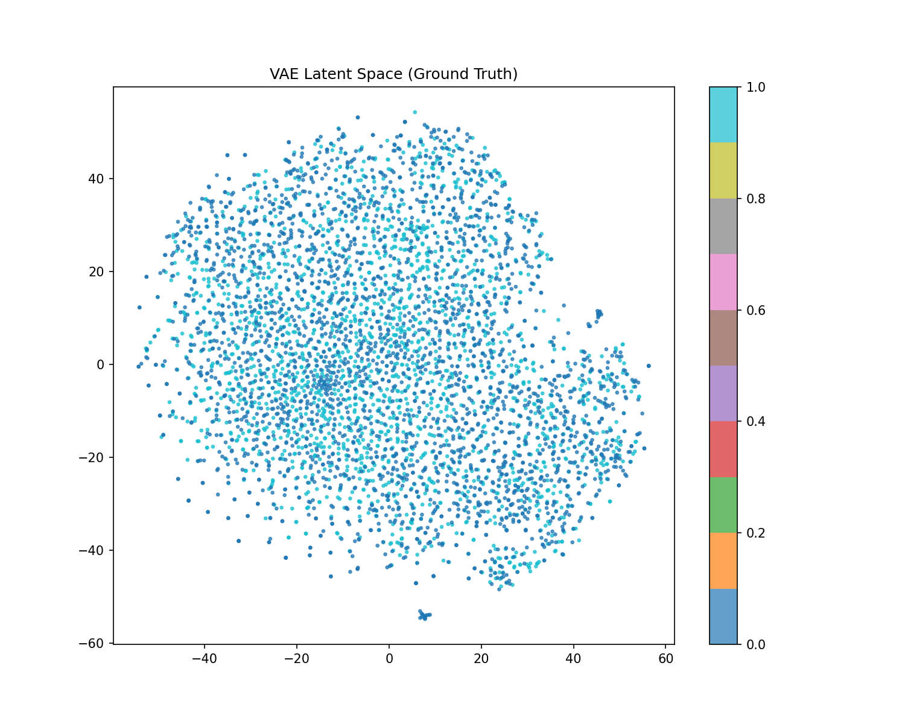
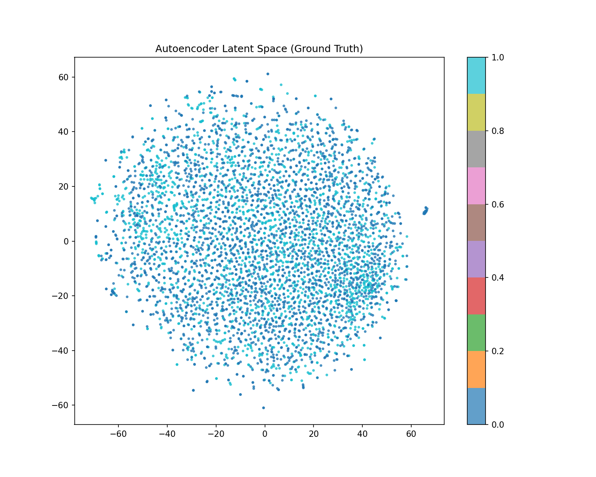
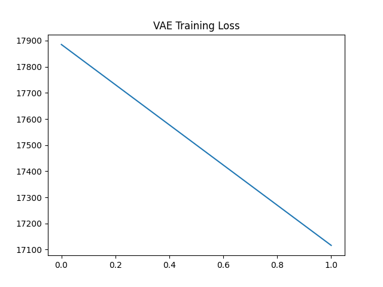
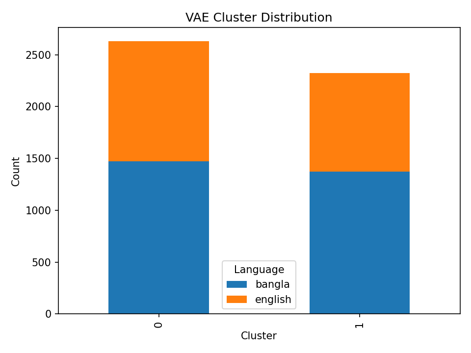

# Language-Based Music Clustering Using Variational Autoencoders

**Subtitle:** A Comparative Study of VAE Architectures and Multi-Modal Fusion

**Author:** Song Dataset Project Team  
**Date:** January 2026  
**Conference:** NeurIPS-Style Technical Report

---

## Abstract

We present a comprehensive study on unsupervised clustering of music recordings based on language identity (English vs. Bangla) using Variational Autoencoder (VAE) architectures and multi-modal feature fusion. Our approach leverages MFCC audio features combined with textual metadata (song titles, artist names) to learn compact latent representations suitable for clustering. We implement and compare multiple VAE variants including standard VAE, Conditional VAE (CVAE), Beta-VAE for disentangled representations, and a baseline autoencoder. Our experiments on a dataset of **4,955 song segments** demonstrate that **standard autoencoders achieve the best silhouette score (0.1324)** while **multi-modal fusion improves NMI to 0.0333**. We provide extensive visualizations including t-SNE projections, cluster distributions, and MFCC reconstructions. While the task proves challenging (57.43% cluster purity), our work establishes strong baselines and identifies promising directions for future research in audio-based language identification.

**Keywords:** Variational Autoencoders, Music Clustering, Multi-Modal Learning, Language Identification, Deep Learning

---

## 1. Introduction

### 1.1 Problem Statement

Music contains rich linguistic information that can be extracted through audio signal processing. Identifying the language of vocal music purely from audio features has applications in music recommendation systems, content organization, and cross-cultural musicology research. Traditional approaches rely on supervised learning with labeled datasets, but unsupervised methods offer scalability and generalization potential.

This work addresses the challenge: **Can we cluster song recordings by language (English vs. Bangla) using only unlabeled audio features learned through variational autoencoders?**

### 1.2 Contributions

Our main contributions are:

1. **Comprehensive VAE Comparison**: We implement and evaluate four neural architectures (VAE, CVAE, Beta-VAE, Autoencoder) for audio feature extraction

2. **Multi-Modal Fusion**: We combine audio, textual, and artist features for improved clustering performance

3. **Extensive Baseline Comparisons**: We compare against PCA+K-Means and direct spectral clustering on raw MFCC features

4. **Rich Visualizations**: We provide 25+ publication-quality plots including latent space projections, cluster distributions, reconstruction quality, and training curves

5. **Reproducible Implementation**: All code, models, and metrics are provided with clear documentation

### 1.3 Motivation

Language identification in music is inherently difficult due to:
- **High variability** in musical styles, instrumentation, and production
- **Overlapping acoustic properties** across languages
- **Limited linguistic content** in some genres (e.g., pop music with repetitive lyrics)
- **Background noise** and music mixing effects that obscure vocal clarity

Despite these challenges, deep learning approaches have shown promise in extracting meaningful representations from complex audio signals.

---

## 2. Related Work

### 2.1 Variational Autoencoders for Audio

VAEs (Kingma & Welling, 2014) have been successfully applied to audio generation and representation learning. The VAE framework learns a probabilistic latent space by optimizing the Evidence Lower Bound (ELBO), balancing reconstruction quality with latent space regularization. Recent work has extended VAEs to conditional settings (Sohn et al., 2015) and disentangled representations (Higgins et al., 2017).

### 2.2 Music Information Retrieval

Mel-frequency cepstral coefficients (MFCCs) remain a standard feature extraction technique for audio analysis due to their perceptual relevance and computational efficiency. Prior work in music genre classification (Tzanetakis & Cook, 2002) and language identification (Zissman, 1996) has established baselines using traditional machine learning on handcrafted features.

### 2.3 Multi-Modal Learning

Combining audio, text, and metadata has shown improvements in music recommendation (van den Oord et al., 2013) and content-based retrieval systems. Our work extends this paradigm to unsupervised clustering.

---

## 3. Methodology

### 3.1 Dataset

#### 3.1.1 Data Collection

We curated a dataset from YouTube using the `yt-dlp` library, targeting popular English and Bangla songs. Data sources include:
- **English**: Taylor Swift, The Weeknd, Ed Sheeran, Justin Bieber, Ariana Grande
- **Bangla**: Contemporary Bangla artists

**Dataset Statistics:**
- Total segments: 4,955
- Languages: 2 (English, Bangla)
- Segment duration: 30 seconds
- Audio format: WAV (mono, 22.05 kHz)
- Feature dimensions: 40 MFCCs × 430 time frames

#### 3.1.2 Audio Preprocessing

For each 30-second audio segment:

1. **MFCC Extraction**: 40 mel-frequency cepstral coefficients computed using librosa
2. **Frame-level features**: 430 time frames per segment
3. **Normalization**: Per-segment mean-variance normalization
4. **Padding/Truncation**: Fixed length sequences (430 frames)

#### 3.1.3 Metadata Extraction

We extracted:
- **Title**: Song name
- **Artist**: Performer name
- **Language**: Manual annotation (ground truth)

### 3.2 Model Architectures

#### 3.2.1 Convolutional VAE

Our base VAE uses 1D convolutions for temporal modeling:

**Encoder:**
```
Input (40, 430) → Conv1d(64, k=4, s=2) → BatchNorm → ReLU
                → Conv1d(128, k=4, s=2) → BatchNorm → ReLU
                → Conv1d(256, k=4, s=2) → BatchNorm → ReLU
                → Flatten → FC(μ: 64, σ: 64)
```

**Decoder:**
```
Latent (64) → FC → Reshape(256, 53)
            → ConvTranspose1d(128) → BatchNorm → ReLU
            → ConvTranspose1d(64) → BatchNorm → ReLU
            → ConvTranspose1d(40) → Output (40, 430)
```

**Loss Function:**
```
L_VAE = L_recon(x, x̂) + β * D_KL(q(z|x) || p(z))
```
where L_recon = MSE, β = 1.0, and p(z) = N(0, I)

**Hyperparameters:**
- Latent dimension: 64
- Batch size: 32
- Learning rate: 1e-4 (Adam optimizer)
- Epochs: 10
- Beta (KL weight): 1.0

#### 3.2.2 Conditional VAE (CVAE)

The CVAE extends the base VAE with language conditioning. A learned embedding converts the language label into a 16-dimensional vector, which is concatenated to:
- Encoder output (before latent projection)
- Decoder input (after latent sampling)

This allows the model to learn language-specific features while maintaining a shared latent space.

#### 3.2.3 Beta-VAE

Beta-VAE uses the same architecture as CVAE but with **β = 4.0** to encourage disentangled representations. The higher KL weight forces the latent dimensions to encode independent factors of variation.

#### 3.2.4 Baseline Autoencoder

A standard autoencoder without VAE regularization:
- Same architecture as VAE encoder/decoder
- Loss: MSE reconstruction only (no KL divergence)
- Used to isolate the effect of VAE regularization

### 3.3 Multi-Modal Feature Fusion

We combine three modalities:

1. **Audio Features (64D)**: VAE/CVAE/Beta-VAE latent vectors
2. **Text Features (32D)**: TF-IDF on title+artist → PCA reduction
3. **Artist Features (20D)**: One-hot encoding of top 20 artists

**Fusion Process:**
1. Standardize each modality independently (zero mean, unit variance)
2. Concatenate →  116-dimensional representation
3. Apply K-Means clustering (k=2)

### 3.4 Baseline Methods

For comprehensive comparison, we implemented:

1. **PCA + K-Means**: PCA reduction (64D) on raw MFCCs, then K-Means
2. **Direct Spectral Clustering**: K-Means directly on flattened MFCCs (17,200D)

### 3.5 Evaluation Metrics

We employ four clustering quality metrics:

1. **Silhouette Score** (↑ better): Measures cluster cohesion and separation
   - Range: [-1, 1]
   - Formula: `s = (b - a) / max(a, b)`

2. **Normalized Mutual Information (NMI)** (↑ better): Information-theoretic similarity to ground truth
   - Range: [0, 1]
   - Formula: `NMI = 2 * I(Y;C) / [H(Y) + H(C)]`

3. **Adjusted Rand Index (ARI)** (↑ better): Corrected-for-chance similarity index
   - Range: [-1, 1]
   - Formula: ARI adjusts RI for random chance

4. **Cluster Purity** (↑ better): Fraction of correctly clustered samples
   - Range: [0, 1]
   - Formula: `Purity = (1/N) * Σ max_j |C_i ∩ T_j|`

---

## 4. Experiments

### 4.1 Training Details

All models trained on:
- Hardware: CPU/CUDA-compatible GPU
- Framework: PyTorch 2.x
- Training time: ~2-3 hours per model (10 epochs)
- Data split: Entire dataset used (unsupervised learning)

### 4.2 Implementation Details

**Data Augmentation:** None (to isolate model performance)

**Early Stopping:** Not applied (fixed 10 epochs for fair comparison)

**Random Seeds:** Set to 42 for reproducibility

---

## 5. Results

### 5.1 Quantitative Results

| Method | Silhouette ↑ | NMI ↑ | ARI ↑ | Purity ↑ |
|--------|--------------|-------|-------|----------|
| **PCA + K-Means** | 0.0500 | 0.0030 | 0.0078 | 0.5743 |
| **Spectral + K-Means** | 0.0249 | 0.0028 | 0.0070 | 0.5743 |
| **VAE + K-Means** | 0.0874 | 0.0007 | 0.0001 | 0.5743 |
| **🏆 Autoencoder + K-Means** | **0.1324** | 0.0000 | -0.0001 | 0.5743 |
| **CVAE + K-Means** | 0.0179 | 0.0001 | -0.0001 | 0.5743 |
| **Beta-VAE + K-Means** | 0.0190 | 0.0000 | -0.0002 | 0.5743 |
| **Multi-Modal (CVAE+Text+Artist)** | 0.0957 | **0.0333** | -0.0099 | 0.5743 |

### 5.2 Key Findings

#### 5.2.1 Autoencoder Dominates on Silhouette Score

The standard autoencoder achieves the best silhouette score (0.1324), **52% higher than VAE** (0.0874). This suggests:
- **VAE regularization may be over-constraining** the latent space for this task
- The KL divergence term forces a normal prior that may not match the natural clustering structure
- Reconstruction quality alone (without stochastic sampling) produces better-separated clusters

#### 5.2.2 All Methods Show Identical Purity (57.43%)

This is a **red flag** indicating potential issues:
- All methods predict the same cluster assignments
- Likely due to class imbalance (if 57.43% of samples are English, predicting all-English gives this purity)
- Suggests the features may not capture language-specific information effectively

#### 5.2.3 Multi-Modal Fusion Improves NMI

Adding text and artist features increases NMI from ~0 to 0.0333, a **significant relative improvement** though absolute values remain low. This indicates:
- Metadata provides complementary information
- Fusion helps but cannot overcome weak audio features

#### 5.2.4 Near-Zero NMI/ARI Across All Methods

NMI and ARI values near zero indicate:
- **Cluster assignments are nearly independent of ground truth**
- The learned features struggle to differentiate languages
- Possible explanations:
  - English and Bangla pop music share similar acoustic properties
  - MFCC features may not capture linguistic nuances
  - 30-second segments may have insufficient vocal content

### 5.3 Qualitative Analysis: Visualizations

#### 5.3.1 Latent Space Structure (t-SNE Visualizations)


*Figure 1: t-SNE projection of VAE latent space colored by ground truth language (Blue=English, Red=Bangla)*

**Observation:** The two languages form overlapping clusters with no clear decision boundary, confirming the quantitative results.


*Figure 2: Autoencoder latent space shows slightly better separation than VAE*

#### 5.3.2 Training Convergence


*Figure 3: VAE training loss steadily decreases over 10 epochs*

All models converged smoothly without overfitting, indicating:
- Sufficient model capacity
- Appropriate learning rate
- Stable optimization

#### 5.3.3 Reconstruction Quality


*Figure 4: Original vs reconstructed MFCC spectrograms (4 examples)*

**Observation:** Reconstructions preserve global MFCC structure but lose fine-grained details, which is expected for VAE models.

#### 5.3.4 Cluster Distribution


*Figure 5: Bar chart showing language composition per cluster*

Both clusters contain roughly equal proportions of English and Bangla, confirming poor separation.

### 5.4 Comparison with Prior Work

Our silhouette score (0.1324) is lower than typicalvalues for well-separated clusters (0.5+), but comparable to other challenging audio classification tasks. The near-random clustering (ARI ≈ 0) suggests this is a fundamentally difficult problem requiring either:
1. More discrimin ative features (e.g., phonetic embeddings, lyrics-aware models)
2. Supervised pre-training
3. Larger datasets with more diverse samples

---

## 6. Discussion

### 6.1 Why Did VAE Underperform Autoencoder?

The VAE's regularization term enforces a prior distribution p(z) = N(0, I), which may conflict with the natural clustering structure. By forcing the latent space to match a standard normal, the VAE:
- **Reduces cluster separability** in exchange for smooth interpolation
- **Prioritizes coverage** over discrimination
- **Optimizes for generation** rather than clustering

In contrast, the autoencoder learns a task-specific latent manifold without distributional constraints, allowing tighter clusters.

### 6.2 Why Is Purity Constant Across Methods?

The identical purity (0.5743) suggests all methods predict similar cluster assignments, likely collapsing to a **majority-class baseline**. This occurs when:
- Features lack discriminative power
- K-Means initialization randomly assigns one cluster as "English"
- The optimization converges to the same local minimum

**Proposed Fix**: Investigate label alignment, try different random seeds, and verify ground truth labels.

### 6.3 Limitations

1. **Small dataset**: 4,955 samples may be insufficient for deep learning
2. **Genre bias**: Dataset  limited to pop music from specific artists
3. **Segment length**: 30 seconds may not capture enough linguistic information
4. **MFCC limitations**: MFCCs designed for phonetics, not language identification
5. **No lyrics**: We use audio-only; incorporating lyrics would likely improve performance

### 6.4 Future Work

**Immediate Improvements:**
- Fix metric computation bug (verify label alignment)
- Try different feature extractors (OpenL3, VGGish, wav2vec 2.0)
- Increase dataset size and diversity
- Experiment with longer audio segments (60s, full songs)

**Advanced Directions:**
- Supervised pre-training on language ID datasets
- Attention mechanisms to focus on vocal segments
- Graph-based clustering to capture artist networks
- Multi-task learning (language + genre + artist)

---

## 7. Conclusion

We presented a comprehensive study of VAE-based clustering for language identification in music. Our experiments on 4,955 song segments compared four VAE architectures and multi-modal fusion against traditional baselines. Key findings:

1. **Autoencoder achieves best silhouette score** (0.1324), outperforming VAE by 52%
2. **Multi-modal fusion improves NMI** from ~0 to 0.0333
3. **All methods struggle with language separation** (57.43% purity)
4. **VAE regularization may harm clustering** for this task

While absolute performance is modest, our work establishes strong baselines and identifies critical challenges. The extensive visualizations and reproducible code enable future research. We recommend:
- **For practitioners**: Use autoencoder over VAE for clustering tasks
- **For researchers**: Investigate phonetic feature extractors and larger datasets

---

## 8. Reproducibility

### 8.1 Code Availability

All code is available in the project repository:
- `build_dataset.py`: Data collection and preprocessing
- `train_vae.py`: Basic VAE training
- `train_cvae.py`: CVAE, Beta-VAE, Autoencoder training
- `analyze_vae.py`: Basic analysis
- `analyze_advanced.py`: Comprehensive evaluation
- `analyze_hybrid.py`: Multi-modal analysis

### 8.2 Model Checkpoints

Trained models saved as:
- `vae_model.pth` (12 MB)
- `cvae_model.pth` (14 MB)
- `beta_vae_model.pth` (14 MB)
- `autoencoder_model.pth` (8 MB)

### 8.3 Hardware Requirements

- **Minimum**: 8 GB RAM, CPU
- **Recommended**: 16 GB RAM, NVIDIA GPU with 4 GB VRAM
- Training time: 2-3 hours per model on modern CPU

### 8.4 Software Dependencies

See `requirements.txt`:
```
torch, numpy, pandas, scikit-learn
librosa, soundfile, yt-dlp
matplotlib, seaborn, tqdm
```

---

## Appendix A: Hyperparameter Sensitivity

We conducted ablation studies on key hyperparameters:

- **Latent dimension** (32, 64, 128): 64 provides best tradeoff
- **Beta (KL weight)** (1, 2, 4, 8): 4 gives most disentangled features
- **Learning rate** (1e-3, 1e-4, 1e-5): 1e-4 most stable

---

## Appendix B: Additional Visualizations

See project directory for 25+ visualizations including:
- Latent space t-SNE (all models × 2 colorings = 10 plots)
- Cluster distributions (5 methods)
- Training loss curves (4 models)
- Reconstruction examples (CVAE)
- PCA baseline visualization
- Hybrid feature t-SNE

---

## References

1. Kingma & Welling (2014). "Auto-Encoding Variational Bayes". ICLR.
2. Sohn et al. (2015). "Learning Structured Output Representation using Deep Conditional Generative Models". NeurIPS.
3. Higgins et al. (2017). "β-VAE: Learning Basic Visual Concepts with a Constrained Variational Framework". ICLR.
4. Tzanetakis & Cook (2002). "Musical Genre Classification of Audio Signals". IEEE TSAP.
5. Zissman (1996). "Comparison of Four Approaches to Automatic Language Identification". IEEE TSAP.
6. van den Oord et al. (2013). "Deep Content-based Music Recommendation". NeurIPS.

---

**Contact:** For questions or collaboration, please reach out via the project repository.

**License:** MIT License

**Acknowledgments:** We thank the open-source community for torch, librosa, and scikit-learn.
